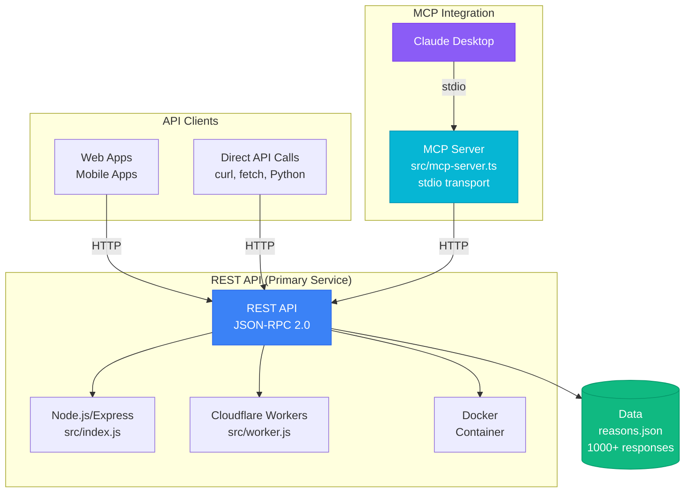

# No-as-a-Service

> Because saying "no" apparently requires an API now.

An API service providing 1,000+ creative ways to decline requests. For those who find saying "no" requires more architectural complexity than it deserves, or who simply appreciate the precision of professionally crafted rejection.

## What Is This?

NoaaS is a **REST API service** with an **MCP server wrapper** that provides creative rejection responses across four categories:

**Two Components:**
- **REST API** (primary) - Public HTTP API anyone can call directly
- **MCP Server** (wrapper) - Bridges Claude Desktop to the REST API via stdio transport

## Architecture



**Key Points:**
- **REST API** is the primary service with all business logic
- **MCP Server** is a thin stdio wrapper that bridges Claude Desktop to the REST API
- This architecture serves both traditional API clients and Claude Desktop simultaneously

**Response Categories:**

- **Polite** - For when you want them to think you actually considered their request
- **Humorous** - Because adding a joke makes rejection feel less like rejection (it doesn't)
- **Professional** - Corporate-approved ways to say no while sounding like you care (you don't)
- **Creative** - For people who think being clever makes them more interesting (debatable)

> **Note:** All responses were generated by AI. So if they're occasionally weird, nonsensical, or sound like a robot trying too hard to be human, that's why. We've kept them anyway. Quality control is overrated.

## Quick Start

### Use the Public Service

Just call the API. No installation, no signup, no nonsense.

```bash
curl -X POST https://api.mcp-for-no.com/v1/tools/call \
  -H "Content-Type: application/json" \
  -d '{"method":"getRandomNo","params":{"category":"humorous"}}'
```

**Response:**
```json
{
  "jsonrpc": "2.0",
  "result": {
    "response": "I'd love to say yes, but my calendar is allergic to that date."
  }
}
```

### Deploy Your Own

Want to run your own instance? We respect your trust issues.

#### Recommended: Cloudflare Workers (Free)

Zero maintenance, global edge network, automatic scaling. The sensible choice.

```bash
npm install
# Copy wrangler config template
cp deployment/wrangler.toml.example deployment/wrangler.toml
npx wrangler login --config deployment/wrangler.toml
npx wrangler kv:namespace create "REASONS_KV" --config deployment/wrangler.toml
npx wrangler kv:namespace create "RATE_LIMIT_KV" --config deployment/wrangler.toml
# Update deployment/wrangler.toml with the KV namespace IDs from the output above
npm run worker:kv:upload
npm run worker:deploy
```

**See:** [docs/deployment/QUICKSTART_WORKERS.md](./docs/deployment/QUICKSTART_WORKERS.md) for detailed instructions.

#### Alternative: Docker (Enterprise/Self-Hosted)

For when you have trust issues with cloud providers or compliance requirements.

```bash
# Docker Compose (recommended)
npm run docker:up

# Or plain Docker
npm run docker:build
docker run -d -p 3000:3000 \
  -e NODE_ENV=production \
  -e CORS_ORIGIN=https://your-domain.com \
  noaas
```

#### Advanced: Node.js/Express

Direct deployment on VPS, PM2, or systemd. You know what you're doing.

```bash
npm install
cp .env.example .env
# Edit .env with your configuration
npm start
```

**See:** [docs/guides/SECURITY.md](./docs/guides/SECURITY.md) for security configuration and best practices.

## Use with Claude Desktop (MCP)

NoaaS includes a native MCP server with stdio transport. Unfortunately, Claude Desktop requires local installation because it cannot connect directly to web services.

> **Why Local Installation?**
>
> Claude Desktop spawns local processes via stdio (stdin/stdout) for MCP servers. It cannot connect to HTTP endpoints directly, even though the actual data comes from our REST API. The local MCP server acts as a thin wrapper that bridges Claude Desktop to the REST API.

### Prerequisites

You need Node.js (v18+) and Git installed:

- **macOS:** `brew install node git`
- **Windows:** Download from [nodejs.org](https://nodejs.org)
- **Linux:** Use your package manager (e.g., `apt install nodejs git`)

### Installation

**1. Clone and build the MCP server:**

```bash
cd ~
git clone https://github.com/Koneisto/no-as-a-service.git
cd no-as-a-service
npm install
npm run mcp:build
```

This creates `build/mcp-server.js` in the cloned directory.

**2. Get the absolute path:**

While still in the `no-as-a-service` directory, run:

```bash
pwd
```

This shows your full path, something like: `/Users/yourname/no-as-a-service`

**📝 Write this down - you'll need it in the next step.**

### Claude Desktop Configuration

**1. Find your config file:**

- **macOS:** `~/Library/Application Support/Claude/claude_desktop_config.json`
- **Windows:** `%APPDATA%\Claude\claude_desktop_config.json`
- **Linux:** `~/.config/Claude/claude_desktop_config.json`

**2. Edit the file and add this configuration:**

Replace `/YOUR/PATH/HERE` with the path from the `pwd` command above:

```json
{
  "mcpServers": {
    "noaas": {
      "command": "node",
      "args": [
        "/YOUR/PATH/HERE/no-as-a-service/build/mcp-server.js"
      ],
      "env": {
        "API_BASE_URL": "https://api.mcp-for-no.com"
      }
    }
  }
}
```

⚠️ **Important:**
- Use forward slashes (`/`) even on Windows
- Replace `/YOUR/PATH/HERE` with your actual path from step 2
- One typo and it won't work - paths are case-sensitive

**3. Restart Claude Desktop:**

Close Claude Desktop completely (quit the application, not just close the window), then reopen it.

**4. Test it:**

Ask Claude:
- _"Give me a polite way to decline this meeting"_
- _"How many different ways to say no do you have?"_

If it doesn't work, check your config file for typos.

### Available Tools

- **getRandomNo** - Get a creative rejection (optional category: polite, humorous, professional, creative)
- **getNoCount** - Get the total count (1,021)

### Troubleshooting

**Config file errors?**
- Validate your JSON at [jsonlint.com](https://jsonlint.com)

**Path wrong?**
- Run `ls build/mcp-server.js` in the repo directory to verify the file exists

**Still not working?**
- Check logs at `~/Library/Logs/Claude/mcp*.log` (macOS)
- Ensure Node.js is installed: `node --version`
- Ensure you restarted Claude Desktop completely

## API Usage (Direct HTTP)

You can also use the REST API directly:

```bash
# Get a random rejection
curl -X POST https://api.mcp-for-no.com/v1/tools/call \
  -H "Content-Type: application/json" \
  -d '{"method":"getRandomNo","params":{"category":"humorous"}}'

# Get count
curl -X POST https://api.mcp-for-no.com/v1/tools/call \
  -H "Content-Type: application/json" \
  -d '{"method":"getNoCount"}'
```

See [examples/usage-examples.md](./examples/usage-examples.md) for code examples in various languages.

## Features

- **No Authentication** - No credit card, no signup, no value proposition
- **Fast Response Times** - Because waiting to say no is apparently unacceptable
- **Global Distribution** - Say no from anywhere in the world, instantly
- **No Tracking** - We don't care enough to track you
- **Rate Limited** - 30 requests per minute. One every 2 seconds. Still generous.
- **MCP Compatible*** - *Via a local stdio wrapper because SSE transport would make too much sense
- **1,000+ Responses** - Because apparently 100 ways to say no wasn't excessive enough
- **No Authentication** - Just send requests. We're too lazy to implement OAuth.

## API Reference

### Get Random Rejection

```bash
POST /v1/tools/call
Content-Type: application/json

{
  "method": "getRandomNo",
  "params": {
    "category": "polite"  // optional: polite, humorous, professional, creative
  }
}
```

### Get Count

```bash
POST /v1/tools/call
Content-Type: application/json

{
  "method": "getNoCount"
}
```

### Health Check

```bash
GET /health
```

**Full API docs:** [TECHNICAL.md](./docs/TECHNICAL.md)

## Project Structure

```
no-as-a-service/
├── src/
│   ├── index.js            # Node.js/Express server
│   └── worker.js           # Cloudflare Workers server
├── data/
│   └── reasons.json        # 921 rejection messages
├── deployment/
│   ├── Dockerfile          # Docker deployment
│   ├── docker-compose.yml  # Docker Compose config
│   └── wrangler.toml       # Cloudflare Workers config
├── docs/
│   ├── deployment/
│   │   ├── QUICKSTART_WORKERS.md
│   │   ├── WORKERS_DEPLOYMENT.md
│   │   ├── CLOUDFLARE_DEPLOY.md
│   │   └── PAGES_DEPLOYMENT.md
│   ├── guides/
│   │   ├── SECURITY.md     # Security best practices
│   │   └── DAILY_LIMIT_GUIDE.md
│   └── TECHNICAL.md        # Full API reference
├── examples/
│   ├── usage-examples.md   # Code examples
│   └── mcp-client-config.json
├── .env.example            # Environment variables template
├── .gitignore              # Git ignore rules
├── package.json            # Dependencies
├── README.md               # You are here
└── LICENSE
```

## Deployment Options

| Method | Cost | Setup Time | Best For |
|--------|------|------------|----------|
| **Cloudflare Workers** ⭐ | $0/month | 5 minutes | Everyone (seriously) |
| **Docker** 🐳 | Variable | 10 minutes | Enterprise, self-hosted, K8s |
| Node.js/Express | $5-12/month | 15 minutes | VPS, custom deployments |
| Cloudflare Tunnel | $0/month | 15 minutes | Behind firewalls |

**Recommended:** Cloudflare Workers (free tier, 100k requests/day, global edge network, zero maintenance)

**When to use Docker:** Compliance requirements, airgapped environments, existing container infrastructure, or trust issues with cloud providers (understandable).

## Documentation

### Deployment Guides
- **[QUICKSTART_WORKERS.md](./docs/deployment/QUICKSTART_WORKERS.md)** - Deploy to Cloudflare Workers in 5 minutes
- **[WORKERS_DEPLOYMENT.md](./docs/deployment/WORKERS_DEPLOYMENT.md)** - Comprehensive Cloudflare Workers guide
- **[CLOUDFLARE_DEPLOY.md](./docs/deployment/CLOUDFLARE_DEPLOY.md)** - All Cloudflare deployment methods
- **[PAGES_DEPLOYMENT.md](./docs/deployment/PAGES_DEPLOYMENT.md)** - Deploy landing page

### Configuration & Security
- **[SECURITY.md](./docs/guides/SECURITY.md)** - Security best practices, environment variables, CORS, rate limiting
- **[DAILY_LIMIT_GUIDE.md](./docs/guides/DAILY_LIMIT_GUIDE.md)** - Daily rate limiting explained

### Technical Reference
- **[TECHNICAL.md](./docs/TECHNICAL.md)** - Full API reference and technical details
- **[examples/usage-examples.md](./examples/usage-examples.md)** - Code examples

## Examples

### JavaScript

```javascript
const response = await fetch('https://noaas.your-deployment.workers.dev/v1/tools/call', {
  method: 'POST',
  headers: { 'Content-Type': 'application/json' },
  body: JSON.stringify({
    method: 'getRandomNo',
    params: { category: 'professional' }
  })
});

const data = await response.json();
console.log(data.result.response);
```

### Python

```python
import requests

response = requests.post(
    'https://noaas.your-deployment.workers.dev/v1/tools/call',
    json={'method': 'getRandomNo', 'params': {'category': 'polite'}}
)

print(response.json()['result']['response'])
```

More examples: [examples/usage-examples.md](./examples/usage-examples.md)

## Contributing

### Add New Rejection Messages

1. Edit `reasons.json`
2. Add your rejection to the appropriate category section
3. Submit a PR

Categories are divided by array index:
- **Polite:** 0-25%
- **Humorous:** 25-50%
- **Professional:** 50-75%
- **Creative:** 75-100%

### Report Issues

Found a bug? [Open an issue](https://github.com/Koneisto/no-as-a-service/issues).

### Code Contributions

PRs welcome for:
- Bug fixes
- Documentation improvements
- New features (please open an issue first)

## FAQ

**Q: What's the cost?**
A: There isn't one. Which should probably concern you, but we're confident you'll use it anyway.

**Q: What are the rate limits?**
A: 30 requests per minute per IP. One every 2 seconds. If you need more than that, you're doing something wrong.

**Q: Can I use this commercially?**
A: Of course. Personal or commercial, we don't discriminate. Just don't blame us when your users hate your app.

**Q: Is there an SLA?**
A: Your expectations should be calibrated to match what you're paying for this.

**Q: Why did you build this?**
A: Someone had to. And apparently, it was us. You're welcome, we suppose.

## License

📄 MIT — do whatever, just don't say yes when you should say no.

## Credits

- Built by people with questionable priorities
- Inspired by everyone who can't say no
- Powered by Cloudflare Workers (probably)

## Links

- **Landing Page:** [mcp-for-no.com](https://mcp-for-no.com)
- **API Endpoint:** [api.mcp-for-no.com](https://api.mcp-for-no.com)
- **Documentation:** [Technical Docs](./docs/TECHNICAL.md)
- **Deploy Guide:** [Cloudflare Workers Quickstart](./docs/deployment/QUICKSTART_WORKERS.md)
- **Issues:** [Report a Bug](https://github.com/Koneisto/no-as-a-service/issues)

---

**NoaaS** - Helping you waste everyone's time more efficiently since 2025.
